# Hybrid Early Warning System (HEWS): Cross-Border Conflict Prediction

## Abstract
This repository implements a theoretical **Hybrid Early Warning System (HEWS)** designed to predict the likelihood of cross-border conflict events involving Bangladesh. Leveraging historical event-level data from the **Uppsala Conflict Data Program (UCDP)**, the system addresses the critical challenge of **extreme class imbalance** (N=8 border violations out of 693 total events). By integrating supervised probabilistic modeling with unsupervised anomaly detection, HEWS provides a dual-signal intelligence framework suitable for operational decision support.

## Key Files
*   `ucdp_border_crossing_ml.ipynb`: Main analysis notebook containing the full pipeline (EDA, Robust Validation, Hybrid Training). See here: https://colab.research.google.com/drive/1G9K4bDiUYltjCdA4i_MlSAD8MSiiHNUn?usp=sharing
*   `model.pkl`: The unified system (Preprocessor + AdaBoost + SVM) saved as a pickle object for deployment.
*   `gedevents-2026-01-17.csv`: UCDP historical event dataset used for training and validation.
*   `EDA-Report.html`: Comprehensive automated data analysis report generated by `ydata-profiling`.

## Methodology & Architecture

```mermaid
graph TD
    subgraph Inputs
        I["Input Data: Sector, Month, Year, Violence Type"]
    end

    I --> P["Preprocessing Pipeline<br/>(StandardScaler + OneHotEncoder)"]
    
    subgraph Hybrid_Tactical_Model [Hybrid Tactical Model]
        direction TB
        P -->|Processed Features| Ada["AdaBoost Classifier<br/>(Precision Signal)"]
        P -->|Processed Features| SVM["One-Class SVM<br/>(Sensitivity Signal)"]
    end
    
    Ada -->|Risk Probability| D{Decision Logic}
    SVM -->|Is Anomaly?| D
    
    D -->|Prob ≥ 0.50| Red["🔴 RED ALERT<br/>High Probability Threat"]
    D -->|Anomaly OR Prob ≥ 0.25| Yellow["🟡 YELLOW ALERT<br/>Unusual Activity"]
    D -->|Routine Pattern| Green["🟢 GREEN<br/>Routine Internal Pattern"]
    
    style Red fill:#ffcccc,stroke:#cc0000,stroke-width:2px
    style Yellow fill:#ffffcc,stroke:#e6e600,stroke-width:2px
    style Green fill:#ccffcc,stroke:#00cc00,stroke-width:2px
```



### 1. Data Pipeline
*   **Source:** UCDP Georeferenced Event Dataset (GED).
*   **Preprocessing:** Five-stage pipeline including automated keyword-based target engineering, temporal feature extraction (Monthly/Yearly), and spatial standardization.
*   **Imbalance Mitigation:** Implementation of **Manual Bootstrap Upsampling** within the cross-validation loop to stabilize minority class learning without introducing global data leakage.

### 2. Hybrid Model Logic
The system discards the traditional "single-best-classifier" approach in favor of a **Dual-Signal Hybrid Architecture**:
*   **Precision Signal (Supervised):** An `AdaBoost` ensemble utilizing decision stumps. This model is optimized for pattern recognition, identifying events that statistically align with historical border conflict characteristics.
*   **Sensitivity Signal (Unsupervised):** A `One-Class Support Vector Machine (SVM)` with a Radial Basis Function (RBF) kernel. Trained exclusively on internal conflict data, it serves as an outlier detector to flag novel or unusual geographic activity that supervised models might overlook.

### 3. Tactical Intelligence Reporting
The system translates machine learning metrics into a three-tier tactical alert framework:
*   **🔴 RED ALERT:** High correlation with historical border conflict patterns (Probability > 50%).
*   **🟡 YELLOW ALERT:** Anomaly detected OR Moderate Probability (> 25%). The event is statistically distinct from internal peace patterns or shows moderate risk signs, necessitating human investigation.
*   **🟢 GREEN:** Statistical alignment with routine internal conflict patterns.

## Technical Stack
*   **Environment:** Python 3.12.3 managed via `uv`.
*   **Modeling:** `scikit-learn` (Ensemble methods, SVM, Pipeline, GridSearchCV).
*   **Validation:** `RepeatedStratifiedKFold` (100 total iterations) to ensure statistical significance given the limited sample size.
*   **Interface:** `Gradio` for real-time tactical dashboarding.
*   **Analysis:** `ydata-profiling` for automated exploratory data analysis.

## Setup & Execution

### Prerequisites
Ensure the `uv` package manager is installed:
```bash
curl -LsSf https://astral.sh/uv/install.sh | sh
```

### Installation
1. Initialize the environment and sync dependencies:
   ```bash
   uv sync
   ```
2. Activate the virtual environment:
   ```bash
   source .venv/bin/activate
   ```

### Operational Use
*   **Training:** Execute the `ucdp_border_crossing_ml.ipynb` notebook to perform the full training, tuning, and validation cycle.
*   **Inference:** The notebook includes a Gradio interface (at the bottom, commented out) that accepts Sector, Month, and Violence Type inputs to generate a Tactical Intelligence Report.
*   **Deployment:** The system is unified into a single `HybridTacticalModel` wrapper class, which can be exported via the included pickling logic for production integration.

## Disclaimer
*   This project is a theoretical exercise and should not be used for real-world operational decision-making without further validation and ethical considerations.

---
*Developed as a theoretical operational planning tool for border security and alertness planning.*
